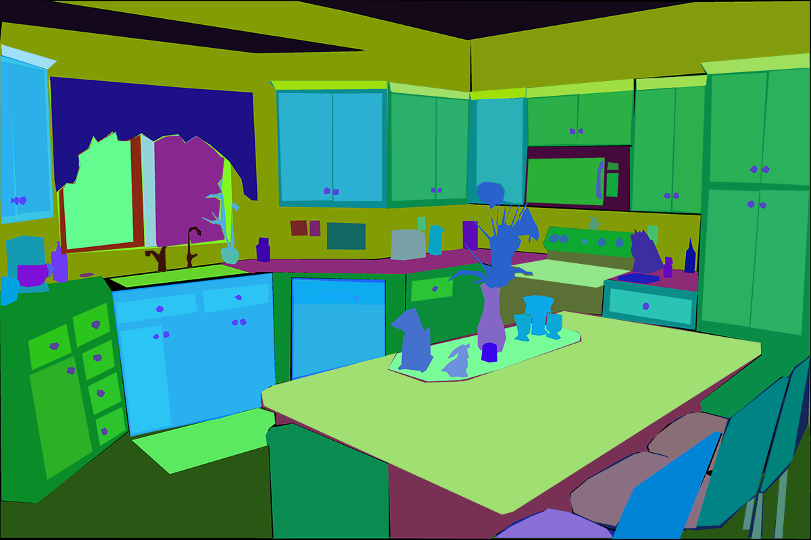

# ADE20K Dataset



This is the repository for the [ADE20K Dataset](http://ade20k.csail.mit.edu/). We provide some information of the dataset, and [starter code](./notebooks/ade20k_starter.ipynb) to explore the data.

## Overview
ADE20K is composed of more than 27K images from the SUN and Places databases. Images are fully annotated with objects, spanning over 3K object categories. Many of the images also contain object parts, and parts of parts. We also provide the original annotated polygons, as well as object instances for amodal segmentation. Images are also anonymized, blurring faces and license plates.

### Dataset stats
The current version of the dataset contains:
* 27,574 images (25,574 for training and 2,000 for testing) spanning 365 different scenes.
* 707,868 unique objects from 3,688 categories, along with their WordNet definition and hierarchy.
* 193,238 annotated object parts and parts of parts.
* Polygon annotations with attributes, annotation time, depth ordering.

### Explore the dataset
While you will need to [sign in](http://ade20k.csail.mit.edu/request_data/) in order to access the dataset, we provide a small subset in `datasets`, so that you can familiarize with the structure. We also provide an `index_ade20k.pkl` that you can download [here](http://ade20k.csail.mit.edu//toolkit/index_ade20k.pkl), to query statistics of the data and the folder where the images are stored.

#### Structure
Every image and its annotations are inside a `folder_name`, that you can find using `index_ade20k.pkl`. Once you are inside the folder name, for a given image `image_name` (e.g. `ADE_train_00016869`) you will find:

1. `image_name.jpg`: containing the raw image, with blurred license plates and faces (e.g. [ADE_train_00016869.jpg](./dataset/ADE20K_2021_17_01/images/ADE/training/urban/street/ADE_train_00016869.jpg))
2. `image_name_seg.png`: with the pixel-wise annotations of objects and instances (e.g. [ADE_train_00016869_seg.png](./dataset/ADE20K_2021_17_01/images/ADE/training/urban/street/ADE_train_00016869_seg.png)). The RGB channels encode the class and instance information. Check out (`utils/utils_ade20k.py`)[utils/utils_ade20k.py] for an example on how to read those.
3. `image_name_parts_{i}.png`: with the annotation of the parts at level `i` (e.g. [ADE_train_00016869_parts_1.png](dataset/ADE20K_2021_17_01/images/ADE/training/urban/street/ADE_train_00016869_parts_1.png)).
4. `image_name`: a folder with all the instances in that image, stored as pngs encoding a binary amodal mask (showing occluded objects) (e.g. [ADE_train_00016869](dataset/ADE20K_2021_17_01/images/ADE/training/urban/street/ADE_train_00016869)).
5. `image_name.json`: a json file containing information about the time the object was annotated, the polygons annotated, annotation of attributes etc. (e.g [ADE_train_00016869.json](dataset/ADE20K_2021_17_01/images/ADE/training/urban/street/ADE_train_00016869.json)).

We provide some [starter code](./notebooks/ade20k_starter.ipynb) to analyze the dataset, basic statistics of the data and links to existing projects using ADE20K.


## Download
To download the dataset, register in [this link](http://ade20k.csail.mit.edu/request_data/). Once you are approved you will be able to download the data, following the [Terms of Use](http://ade20k.csail.mit.edu/terms).

## ADE20K related projects
Here is a list of existing challenges and projects using ADE20K data. Contact us if you would like to include the dataset in a new benchmark.
* [MIT Scene Parsing Benchmark in Pytorch](https://github.com/CSAILVision/semantic-segmentation-pytorch) A semantic segmentation benchmark with baseline models in PyTorch, using a subset of 150 classes from ADE20K.
* [Robust Vision Challenge](http://www.robustvision.net/): A challenge to evaluate the robustness of models to multiple datasets and tasks, including semantic and instance segmentation, depth prediction, optical flow, etc.

## Terms
The data can be used under the following [Terms of Use](http://ade20k.csail.mit.edu/terms).

## Citation
If you use this data, please cite the following papers:

Zhou, B., Zhao, H., Puig, X., Xiao, T., Fidler, S., Barriuso, A., & Torralba, A. (2019). Semantic understanding of scenes through the ade20k dataset. International Journal of Computer Vision, 127(3), 302-321.

```
@article{zhou2019semantic,
  title={Semantic understanding of scenes through the ade20k dataset},
  author={Zhou, Bolei and Zhao, Hang and Puig, Xavier and Xiao, Tete and Fidler, Sanja and Barriuso, Adela and Torralba, Antonio},
  journal={International Journal of Computer Vision},
  volume={127},
  number={3},
  pages={302--321},
  year={2019},
  publisher={Springer}
}
```

Zhou, B., Zhao, H., Puig, X., Fidler, S., Barriuso, A., & Torralba, A. (2017). Scene Parsing through ADE20K Dataset. Proceedings of the IEEE Conference on Computer Vision and Pattern Recognition (CVPR).

```
    @inproceedings{zhou2017scene,
        title={Scene Parsing through ADE20K Dataset},
        author={Zhou, Bolei and Zhao, Hang and Puig, Xavier and Fidler, Sanja and Barriuso, Adela and Torralba, Antonio},
        booktitle={Proceedings of the IEEE Conference on Computer Vision and Pattern Recognition},
        year={2017}
    }
```
